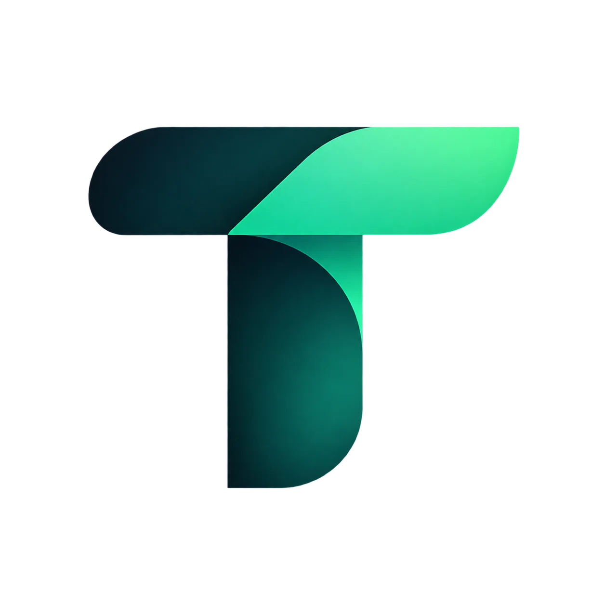

<div align="center">



# ToolsTok

### Discover the AI ecosystem.

**Open-source, community-powered platform for discovering, exploring, comparing, verifying, and sharing AI tools and resources.**

<p>
  <a href="#about">About</a> •
  <a href="#features">Features</a> •
  <a href="#project-structure">Architecture</a> •
  <a href="#getting-started">Getting Started</a> •
  <a href="#contributing">Contributing</a> •
  <a href="./docs/PROJECT_DETAILS.md">Project Details</a>
</p>

</div>

---

## About

**ToolsTok** is an open-source AI discovery platform built to make the rapidly growing AI ecosystem easier to explore.

Instead of treating AI discovery as a simple list of websites, ToolsTok is designed around **structured ecosystem data** — helping people discover AI tools, models, agents, MCP servers, workflows, datasets, APIs, frameworks, infrastructure, and other AI resources.

> **Discover. Compare. Explore. Build with AI.**

ToolsTok is designed for AI beginners, developers, creators, researchers, students, businesses, and open-source contributors.

### What ToolsTok is not

ToolsTok is not:

- A prompt marketplace or prompt library
- An AI news website
- A generic software directory
- An affiliate-only directory
- An AI-generated SEO content farm
- A platform where paid placement silently determines rankings
- A system that incorrectly labels software as open source

The goal is to build a **useful, structured, transparent, and community-powered AI ecosystem directory.**

---

## Why ToolsTok?

The AI ecosystem is expanding rapidly.

There are thousands of:

- AI applications
- Open-source projects
- Models and open-weight models
- AI agents
- MCP servers
- Developer frameworks
- APIs and SDKs
- Automation platforms
- Datasets
- Infrastructure projects
- Local and self-hosted AI projects
- AI hardware and robotics projects

Finding the right resource is becoming increasingly difficult.

ToolsTok aims to provide a structured discovery layer for this ecosystem.

---

## Core Principles

### Open

ToolsTok is open source and designed to encourage community participation.

### Useful

Discovery should help users actually find the right resource for their needs.

### Structured

Resources should contain meaningful, structured information instead of thin directory listings.

### Trustworthy

Open-source status, licensing, verification, project activity, and other important information should be represented clearly.

### Community-powered

Users should be able to submit resources, suggest corrections, contribute information, create collections, and help improve the ecosystem.

### AI-native

Search, discovery, relationships, recommendations, and future platform capabilities can use AI where it genuinely improves the experience.

### Sustainable

ToolsTok should be useful without compromising trust through opaque rankings or misleading commercial incentives.

---

## Features

### AI Resource Discovery

Discover different types of resources across the AI ecosystem:

- AI tools
- Models
- Agents
- MCP servers
- Skills
- Workflows
- Automations
- Datasets
- SDKs
- APIs
- Frameworks
- Infrastructure
- Hardware
- Robotics
- Other emerging AI resources

### Search & Discovery

The platform is designed around powerful discovery capabilities including:

- Global search
- Categories
- Tags
- Filters
- New resources
- Popular resources
- Trending resources
- Related resources
- Similar tools
- Open-source alternatives
- Free and self-hosted discovery

### Trust & Verification

ToolsTok distinguishes between different source models instead of incorrectly treating everything as open source:

- **Open Source**
- **Source Available**
- **Open Weight**
- **Proprietary**
- **Unknown**

Resource records can also contain:

- Repository information
- License information
- Verification status
- Verification date
- External identifiers
- Project activity metrics

### Community Contributions

The platform is designed to support community participation through:

- Resource submissions
- Edit suggestions
- Reports
- Reviews
- Collections
- Saved resources
- Moderation
- Verification workflows

### Developer-Friendly Architecture

ToolsTok is being built with:

- Next.js
- TypeScript
- PostgreSQL
- Drizzle ORM
- Supabase
- PostgreSQL full-text search
- pgvector
- Zod
- Tailwind CSS
- shadcn/ui

The architecture is intentionally designed as a **modular monolith first**, allowing the platform to scale without introducing unnecessary complexity too early.

---

## Project Status

ToolsTok is currently under active development.

### Current foundation

- [x] Next.js application foundation
- [x] TypeScript
- [x] Tailwind CSS
- [x] Shared application UI foundation
- [x] Environment configuration
- [x] PostgreSQL database
- [x] Drizzle ORM
- [x] Initial database schema
- [x] Database migrations
- [x] Resource model
- [x] Taxonomy model
- [x] Repository model
- [x] User model
- [x] Contributions and moderation foundation
- [x] Reviews foundation
- [x] Collections and saved resources foundation
- [x] Resource relationships
- [x] Verification foundation
- [x] Search data foundation
- [x] Versioned API foundation
- [x] Rate limiting foundation
- [x] Authentication foundation
- [x] SEO foundation
- [x] Sitemap
- [x] Robots configuration
- [x] Production build

### In development

- [ ] Production resource discovery experience
- [ ] Advanced search
- [ ] Filtering
- [ ] Resource profile pages
- [ ] Categories
- [ ] Tags
- [ ] Alternatives
- [ ] Comparison
- [ ] Community submissions
- [ ] Moderation interface
- [ ] GitHub/project health integration
- [ ] Data freshness workflows
- [ ] AI-native discovery

The roadmap will evolve as the project develops.

---

## Project Structure

```text
toolstok/
├── docs/
│   └── PROJECT_DETAILS.md
│
├── public/
│   ├── brand/
│   └── icons/
│
├── scripts/
│
├── src/
│   ├── app/
│   │   ├── api/
│   │   │   └── v1/
│   │   ├── admin/
│   │   ├── account/
│   │   └── tools/
│   │
│   ├── components/
│   │   ├── categories/
│   │   ├── collections/
│   │   ├── compare/
│   │   ├── search/
│   │   ├── shared/
│   │   ├── tools/
│   │   └── ui/
│   │
│   ├── config/
│   ├── db/
│   │   ├── migrations/
│   │   ├── queries/
│   │   └── schema/
│   │
│   ├── lib/
│   │   ├── api/
│   │   ├── auth/
│   │   ├── github/
│   │   ├── ingestion/
│   │   ├── rate-limit/
│   │   ├── search/
│   │   ├── seo/
│   │   ├── supabase/
│   │   └── verification/
│   │
│   ├── services/
│   ├── types/
│   └── validation/
│
├── drizzle.config.ts
├── CONTRIBUTING.md
├── package.json
└── README.md
```

---

## Getting Started

### Requirements

Make sure you have:

- Node.js
- pnpm
- PostgreSQL or a compatible managed PostgreSQL provider

### Install

Clone the repository and install dependencies:

```bash
git clone https://github.com/rakibulia/toolstok.git
cd toolstok
pnpm install
```

### Environment

Copy the example environment file:

```bash
cp .env.example .env.local
```

Configure the required values in `.env.local`.

The primary public application URL is controlled through:

```env
NEXT_PUBLIC_SITE_URL=http://localhost:3000
```

ToolsTok intentionally avoids hardcoding the production domain throughout the application.

### Development

Start the development server:

```bash
pnpm dev
```

Open:

```text
http://localhost:3000
```

### Production Build

Run:

```bash
pnpm build
```

---

## Database

ToolsTok uses PostgreSQL with Drizzle ORM.

Generate migrations:

```bash
pnpm exec drizzle-kit generate
```

Apply migrations:

```bash
npx tsx .\scripts\migrate.ts
```

The database schema is designed around an extensible resource model so that ToolsTok can expand beyond traditional AI tools without requiring a complete architectural rewrite.

---

## Documentation

The detailed product and technical specification is maintained separately:

**[Read the complete ToolsTok Project Details →](./docs/PROJECT_DETAILS.md)**

It covers:

- Product vision
- Product boundaries
- MVP scope
- Resource architecture
- Database design
- Search architecture
- Verification
- GitHub integration
- Ranking
- SEO
- Security
- API architecture
- Community systems
- AI capabilities
- Scalability
- Deployment
- Roadmap
- Development principles

Additional project documentation will be added under `docs/` as the project evolves.

---

## Contributing

ToolsTok is built as an open-source project and welcomes meaningful contributions.

You can contribute by:

- Adding or improving resources
- Fixing bugs
- Improving the UI/UX
- Improving search and discovery
- Improving documentation
- Adding tests
- Improving accessibility
- Working on integrations
- Improving data quality
- Proposing new ecosystem capabilities

Before contributing, please read:

**[CONTRIBUTING.md →](./CONTRIBUTING.md)**

---

## Development Philosophy

ToolsTok follows a few important engineering principles:

1. **Build the data model before scaling the UI.**
2. **Prefer structured data over generated content.**
3. **Do not hardcode deployment-specific URLs.**
4. **Keep public pages SEO-friendly and server-rendered where appropriate.**
5. **Use client-side JavaScript only when interaction requires it.**
6. **Keep business logic independent from individual infrastructure providers where practical.**
7. **Start with a modular monolith instead of premature microservices.**
8. **Treat open-source verification seriously.**
9. **Design for community contributions and moderation from the beginning.**
10. **Optimize for usefulness and trust rather than vanity metrics.**

---

## Roadmap

The long-term vision for ToolsTok extends beyond a traditional AI tools directory.

Potential future capabilities include:

- Advanced semantic search
- AI-powered discovery
- Resource recommendation
- Similarity and alternatives
- Multi-resource comparison
- GitHub project intelligence
- Resource health scoring
- Community collections
- Public ecosystem datasets
- Developer API
- Embeddable discovery widgets
- Automated data ingestion
- Verification pipelines
- Open-source ecosystem analytics
- Local/self-hosted AI discovery
- AI model discovery
- Agent and MCP ecosystem discovery
- AI infrastructure discovery
- Ecosystem graphs and relationships

The exact roadmap will evolve based on community needs and real-world usage.

---

## Open Source

ToolsTok is intended to remain an open-source project.

The goal is to build infrastructure that the community can inspect, improve, extend, and eventually build upon.

If you believe AI discovery should be more open, structured, transparent, and useful:

**Contribute, build, and help shape ToolsTok.**

---

<div align="center">

### ToolsTok

**Discover the AI ecosystem.**

[Project Details](./docs/PROJECT_DETAILS.md) • [Contributing](./CONTRIBUTING.md)

</div>